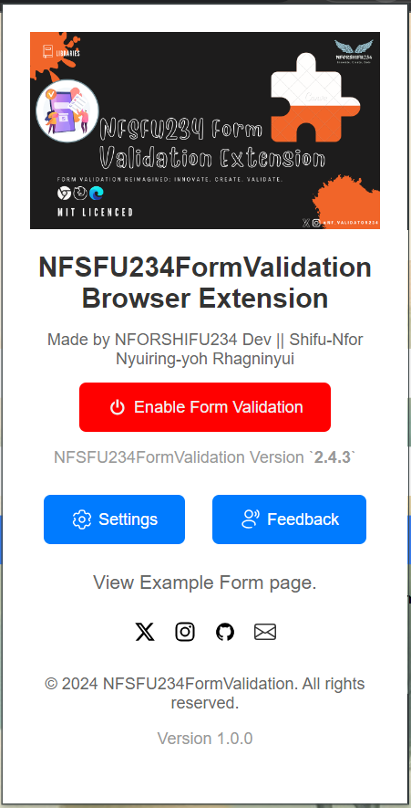
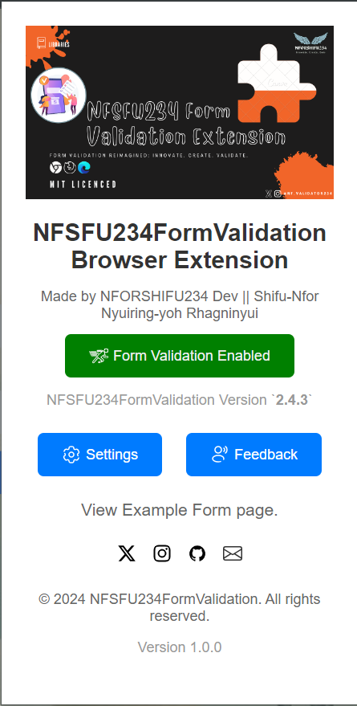
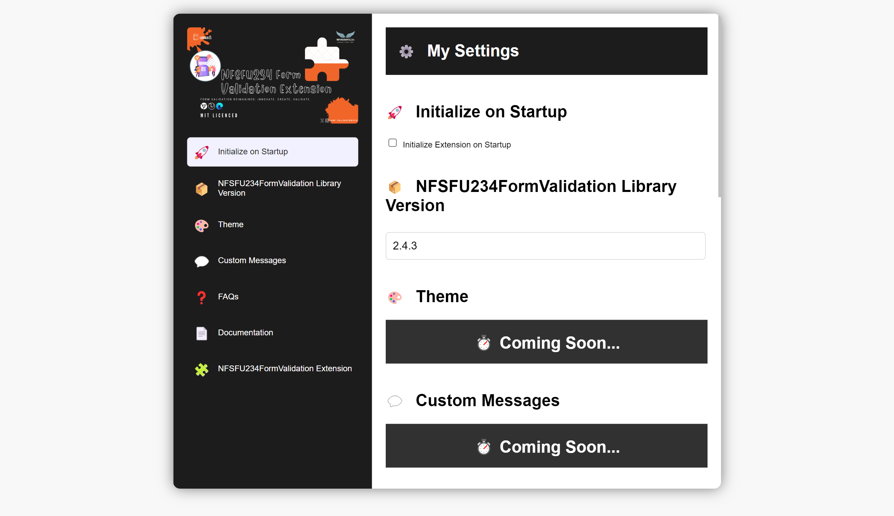
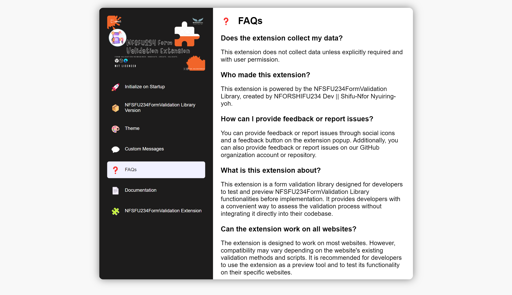
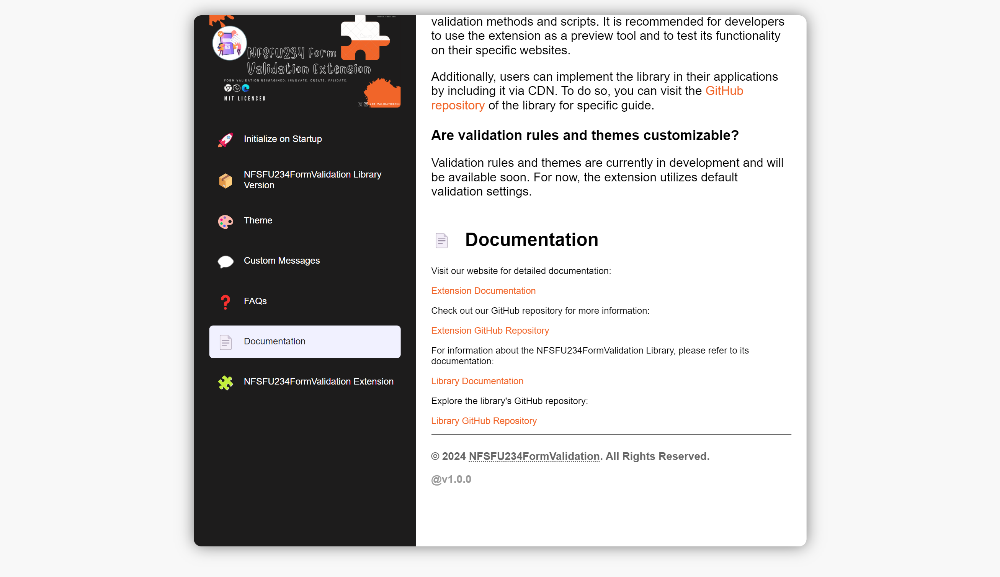
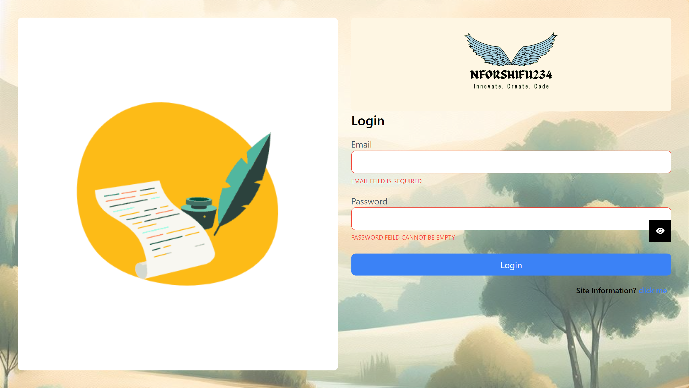
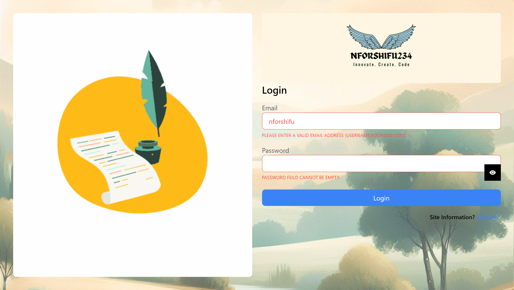
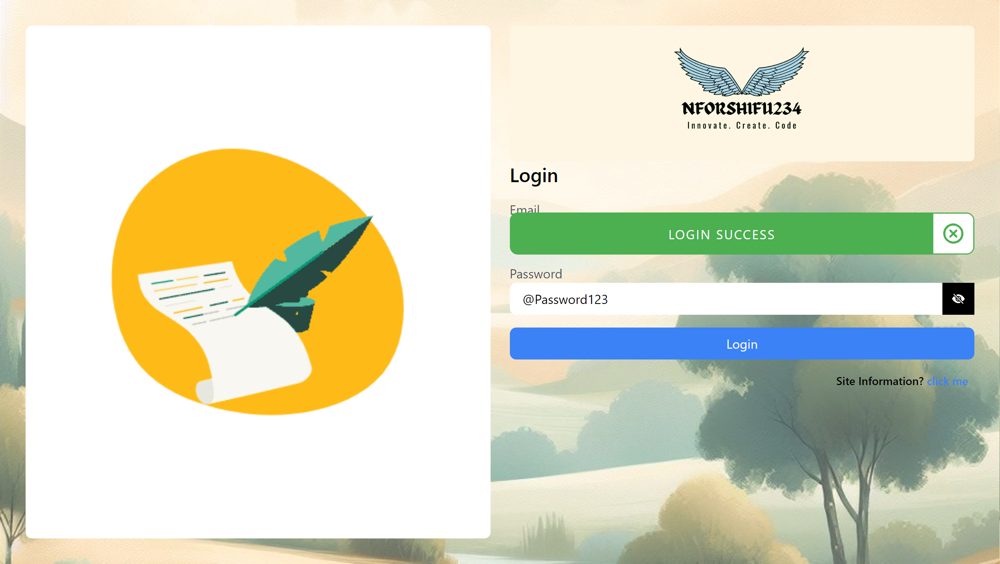

# 🧩 NFSFU234FormValidation Browser Extension Screenshots

Take a look at what the extension looks like 😊

## Popup Page

## Options Page

## Demonstration (Login Form [By NFORSHIFU234 Dev 🖤👨🏾‍💻 || Shifu-Nfor Nyuiring-yoh Rhagninyui](https://github.com/NFSFU234FormValidation/examples//nfsfu234formvalidation-web-extension-examples/form1/))

## 🤝 Contributing
Feeling inspired? We'd love your help in making this extension even better. Jump into the code, fix bugs, add features, and submit your contributions via pull requests!

## 📝 License
The NFSFU234FormValidation Browser Extension is distributed under the [MIT License](LICENSE).

## 📬 Connect
Have questions or feedback? Reach out to us on social media or drop by our GitHub repository. Let's chat!
- Twitter: [@NFSFU234FormValidation](https://twitter.com/nf_validator234)
- GitHub: [NFSFU234FormValidation](https://github.com/NFSFU234FormValidation/)
- Email: nf.validator@gmail.com

## 🌟 Happy Validating!
Thanks for using the NFSFU234FormValidation Browser Extension. Keep validating, and happy coding!